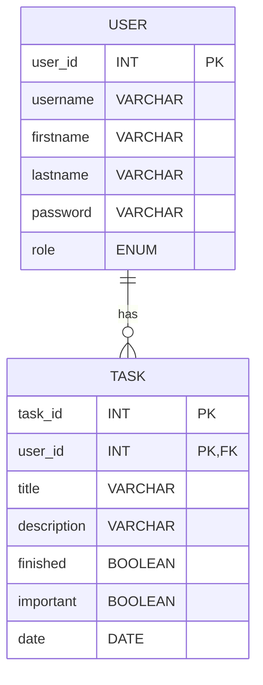

# Task Manager (Gestor de Tareas - API REST con Autenticación JWT)

1. [Introducción](#introducción)

   - [Descripción del Proyecto](#descripción-del-proyecto)
   - [Tecnologías Utilizadas](#tecnologías-utilizadas)

2. [Arquitectura](#arquitectura)

3. [Configuración del Entorno](#configuración-del-entorno)

   - [Requisitos del Sistema](#requisitos-del-sistema)
   - [Instrucciones de Implementación](#instrucciones-de-implementación)
     - [Backend](#backend)
     - [Frontend](#frontend)

4. [Modelo de Datos](#modelo-de-datos)

   - [Diagrama de Entidad-Relación (ER)](#diagrama-de-entidad-relación-er)
   - [Descripción de Entidades](#descripción-de-entidades)
     - [Tarea](#tarea)
     - [Usuario (User)](#usuario-user)
     - [Rol (Role)](#rol-role)

5. [API REST](#api-rest)

   - [TaskController](#taskcontroller)

     - [Obtener Tarea por ID](#obtener-tarea-por-id)
     - [Obtener Todas las Tareas por ID de Usuario](#obtener-todas-las-tareas-por-id-de-usuario)
     - [Obtener Todas las Tareas Completadas por ID de Usuario](#obtener-todas-las-tareas-completadas-por-id-de-usuario)
     - [Obtener Todas las Tareas Pendientes por ID de Usuario](#obtener-todas-las-tareas-pendientes-por-id-de-usuario)
     - [Obtener Todas las Tareas Importantes por ID de Usuario](#obtener-todas-las-tareas-importantes-por-id-de-usuario)
     - [Crear Nueva Tarea](#crear-nueva-tarea)
     - [Actualizar Tarea Existente](#actualizar-tarea-existente)
     - [Cambia el Estado de una tarea por su ID](#cambia-el-estado-de-una-tarea-por-su-id)
     - [Eliminar Tarea por ID](#eliminar-tarea-por-id)

   - [AuthController](#authcontroller)

     - [Iniciar Sesión (Login)](#iniciar-sesión-login)
     - [Registrar Nuevo Usuario](#registrar-nuevo-usuario)

6. [Seguridad](#seguridad)

   - [Configuración de Spring Security y JWT](#configuración-de-spring-security-y-jwt)
   - [Protección de Rutas y Recursos](#protección-de-rutas-y-recursos)

7. [Despliegue](#despliegue)
   - [Frontend](#deploy-frontend)
   - [Backend](#deploy-backend)

## Introducción

### Descripción del Proyecto

El Gestor de Tareas es una aplicación Full Stack construida con Spring Boot 3 y Java 17 para el backend y React con Tailwind CSS para el frontend. La autenticación se basa en JWT, utilizando Spring Security para la seguridad del backend y react-router-dom para la navegación en el frontend.

### Tecnologías Utilizadas

- Backend:

  - Spring Boot 3
  - Java 17
  - Spring Security
  - JWT
  - Maven
  - Hibernate JPA

- Base de Datos:

  - PostgreSQL

- Frontend:
  - React
  - Tailwind CSS
  - react-router-dom
  - react-hook-form
  - react-hot-toast

## Arquitectura

La aplicación sigue una arquitectura monolítica, con el backend implementado como una API RESTful y el frontend como una aplicación de una sola página (SPA).

## Configuración del Entorno

### Requisitos del Sistema

- Java 17
- Node.js
- PostgreSQL
- Maven

### Instrucciones de Implementación

#### Backend

1.  Clona el repositorio desde [TaskManager Repository](https://github.com/AlejoCzombos/TaskManager.git).

2.  Configura el archivo application.properties con los datos de tu base de datos PostgreSQL local:
    (El archivo se encuentra en la ruta `src/main/resorces/application.properties`)

        ```properties
        spring.datasource.url=jdbc:postgresql://localhost:5432/TU_BASE_DE_DATOS
        spring.datasource.username=TU_USUARIO
        spring.datasource.password=TU_CONTRASEÑA
        spring.datasource.driver-class-name=org.postgresql.Driver
        spring.jpa.database-platform=org.hibernate.dialect.PostgreSQLDialect

        spring.jpa.hibernate.ddl-auto=update
        ```

3.  Navega hasta la carpeta del backend con `cd /Backend/`
4.  Ejecuta el backend usando `mvn spring-boot:run`.

#### Frontend

1. Clona el repositorio desde [TaskManager Repository](https://github.com/AlejoCzombos/TaskManager.git).
2. Navega hasta la carpeta del frontend con `cd /Front/`
3. Instala las dependencias del frontend con `npm install`.
4. Inicia el servidor de desarrollo del frontend con `npm run dev`.

## Modelo de Datos

### Diagrama de Entidad-Relación (ER)



## Descripción de Entidades

### Tarea

- **Descripción:** Representa una tarea en el sistema.
- **Atributos:**
  - `id`: Long (ID de la tarea, autogenerado)
  - `title`: String (Título de la tarea)
  - `description`: String (Descripción de la tarea)
  - `finished`: Boolean (Estado de finalización de la tarea)
  - `important`: Boolean (Indicador de tarea importante)
  - `date`: Date (Fecha de la tarea)
  - `user_id`: Long (ID del usuario al que pertenece la tarea)

### Usuario (User)

- **Descripción:** Representa a un usuario del sistema.
- **Atributos:**
  - `id`: Long (ID del usuario, autogenerado)
  - `username`: String (Nombre de usuario único)
  - `firstname`: String (Nombre del usuario)
  - `lastname`: String (Apellido del usuario)
  - `password`: String (Contraseña del usuario, encriptada)
  - `role`: Role (Rol del usuario, ADMIN o USER)

### Rol (Role)

- **Descripción:** Enumeración de roles posibles para un usuario.
- **Valores:**
  - `ADMIN`: Rol de administrador.
  - `USER`: Rol de usuario normal.

## Seguridad

### Configuración de Spring Security y JWT

La aplicación utiliza Spring Security para la gestión de la seguridad y JWT (JSON Web Tokens) para la autenticación.

### Protección de Rutas y Recursos

Las rutas y recursos sensibles de la API están protegidos mediante Spring Security. Se utiliza un sistema de tokens JWT para la autenticación, lo que garantiza que solo los usuarios autenticados y autorizados puedan acceder a ciertos recursos y realizar ciertas acciones en la aplicación.

## API REST

### TaskController

| Método | Endpoint                | Descripción                                                  | Enlace Rápido                                                                                                     |
| ------ | ----------------------- | ------------------------------------------------------------ | ----------------------------------------------------------------------------------------------------------------- |
| GET    | `/api/tasks/{taskId}`   | Obtiene una tarea por su ID.                                 | [Obtener Tarea por ID](#obtener-tarea-por-id)                                                                     |
| GET    | `/api/tasks`            | Obtiene todas las tareas asociadas a un usuario por su ID.   | [Obtener Todas las Tareas por ID de Usuario](#obtener-todas-las-tareas-por-id-de-usuario)                         |
| GET    | `/api/tasks/finished`   | Obtiene todas las tareas completadas asociadas a un usuario. | [Obtener Todas las Tareas Completadas por ID de Usuario](#obtener-todas-las-tareas-completadas-por-id-de-usuario) |
| GET    | `/api/tasks/unfinished` | Obtiene todas las tareas pendientes asociadas a un usuario.  | [Obtener Todas las Tareas Pendientes por ID de Usuario](#obtener-todas-las-tareas-pendientes-por-id-de-usuario)   |
| GET    | `/api/tasks/important`  | Obtiene todas las tareas importantes asociadas a un usuario. | [Obtener Todas las Tareas Importantes por ID de Usuario](#obtener-todas-las-tareas-importantes-por-id-de-usuario) |
| POST   | `/api/tasks`            | Crea una nueva tarea para un usuario.                        | [Crear Nueva Tarea](#crear-nueva-tarea)                                                                           |
| PUT    | `/api/tasks`            | Actualiza una tarea existente para un usuario.               | [Actualizar Tarea Existente](#actualizar-tarea-existente)                                                         |
| PUT    | `/api/tasks/{taskId}`   | Actualiza el estado de una tarea a completada por su ID.     | [Cambia el Estado de una tarea por su ID](#cambia-el-estado-de-una-tarea-por-su-id)                               |
| DELETE | `/api/tasks/{taskId}`   | Elimina una tarea por su ID.                                 | [Eliminar Tarea por ID](#eliminar-tarea-por-id)                                                                   |

#### Obtener Tarea por ID

- **Endpoint:** `GET /api/tasks/{taskId}`
- **Descripción:** Obtiene una tarea por su ID.
- **Parámetros:**
  - `taskId`: Long (ID de la tarea)
- **Respuesta:**
  - `200 OK`: Tarea obtenida exitosamente.
  - `404 Not Found`: Tarea no encontrada.

#### Obtener Todas las Tareas por ID de Usuario

- **Endpoint:** `GET /api/tasks`
- **Descripción:** Obtiene todas las tareas asociadas a un usuario por su ID.
- **Parámetros:**
  - `userId`: Long (ID de usuario)
- **Respuesta:**
  - `200 OK`: Lista de tareas obtenida exitosamente.
  - `404 Not Found`: Usuario no encontrado o sin tareas asociadas.

#### Obtener Todas las Tareas Completadas por ID de Usuario

- **Endpoint:** `GET /api/tasks/finished`
- **Descripción:** Obtiene todas las tareas completadas asociadas a un usuario por su ID.
- **Parámetros:**
  - `userId`: Long (ID de usuario)
- **Respuesta:**
  - `200 OK`: Lista de tareas completadas obtenida exitosamente.
  - `404 Not Found`: Usuario no encontrado o sin tareas completadas asociadas.

#### Obtener Todas las Tareas Pendientes por ID de Usuario

- **Endpoint:** `GET /api/tasks/unfinished`
- **Descripción:** Obtiene todas las tareas pendientes asociadas a un usuario por su ID.
- **Parámetros:**
  - `userId`: Long (ID de usuario)
- **Respuesta:**
  - `200 OK`: Lista de tareas pendientes obtenida exitosamente.
  - `404 Not Found`: Usuario no encontrado o sin tareas pendientes asociadas.

#### Obtener Todas las Tareas Importantes por ID de Usuario

- **Endpoint:** `GET /api/tasks/important`
- **Descripción:** Obtiene todas las tareas importantes asociadas a un usuario por su ID.
- **Parámetros:**
  - `userId`: Long (ID de usuario)
- **Respuesta:**
  - `200 OK`: Lista de tareas importantes obtenida exitosamente.
  - `404 Not Found`: Usuario no encontrado o sin tareas importantes asociadas.

#### Crear Nueva Tarea

- **Endpoint:** `POST /api/tasks`
- **Descripción:** Crea una nueva tarea para un usuario.
- **Parámetros:**
  - `task`: Task (Cuerpo de la solicitud con la información de la tarea)
  - `userId`: Long (ID de usuario)
- **Respuesta:**
  - `201 Created`: Tarea creada exitosamente.
  - `400 Bad Request`: Error en la solicitud (Intento de creación con taskId).
  - `404 Not Found`: Usuario no encontrado.
- **Request Body:**

  ```json
  {
    "title": "String",
    "description": "String",
    "finished": false,
    "important": false,
    "date": "YYYY-MM-DD"
  }
  ```

#### Actualizar Tarea Existente

- **Endpoint:** `PUT /api/tasks`
- **Descripción:** Actualiza una tarea existente para un usuario.
- **Parámetros:**
  - `task`: Task (Cuerpo de la solicitud con la información actualizada de la tarea)
  - `userId`: Long (ID de usuario)
- **Respuesta:**
  - `200 OK`: Tarea actualizada exitosamente.
  - `404 Not Found`: Tarea o usuario no encontrados.
- **Request Body:**

  ```json
  {
    "id": 1,
    "title": "String",
    "description": "String",
    "finished": false,
    "important": false,
    "date": "YYYY-MM-DD"
  }
  ```

#### Cambia el Estado de una tarea por su ID

- **Endpoint:** `PUT /api/tasks/{taskId}`
- **Descripción:** Cambia el estado de una tarea por su ID.
- **Parámetros:**
  - `taskId`: Long (ID de la tarea)
- **Respuesta:**
  - `200 OK`: Estado de la tarea actualizado a completada exitosamente.
  - `404 Not Found`: Tarea no encontrada.

#### Eliminar Tarea por ID

- **Endpoint:** `DELETE /api/tasks/{taskId}`
- **Descripción:** Elimina una tarea por su ID.
- **Parámetros:**
  - `taskId`: Long (ID de la tarea)
- **Respuesta:**
  - `204 No Content`: Tarea eliminada exitosamente.
  - `404 Not Found`: Tarea no encontrada.

### AuthController

| Método | Endpoint             | Descripción                                        | Enlace Rápido                                       |
| ------ | -------------------- | -------------------------------------------------- | --------------------------------------------------- |
| POST   | `/api/auth/login`    | Inicia sesión y devuelve un token JWT.             | [Iniciar Sesión (Login)](#iniciar-sesión-login)     |
| POST   | `/api/auth/register` | Registra un nuevo usuario y devuelve un token JWT. | [Registrar Nuevo Usuario](#registrar-nuevo-usuario) |

#### Iniciar Sesión (Login)

- **Endpoint:** `POST /api/auth/login`
- **Descripción:** Inicia sesión y devuelve un token JWT.
- **Respuesta:**

  - `200 OK`: Inicio de sesión exitoso, devuelve un token JWT.
  - `401 Unauthorized`: Credenciales incorrectas.
  - **Request Body:**

  ```json
  {
    "username": "String",
    "password": "String"
  }
  ```

#### Registrar Nuevo Usuario

- **Endpoint:** `POST /api/auth/register`
- **Descripción:** Registra un nuevo usuario y devuelve un token JWT.
- **Parámetros:**
  - `request`: RegisterRequest (Cuerpo de la solicitud con los detalles del nuevo usuario)
- **Respuesta:**
  - `200 OK`: Registro exitoso, devuelve un token JWT.
  - `400 Bad Request`: Error en la solicitud o usuario ya existente.
- **Request Body:**

  ```json
  {
    "username": "String",
    "password": "String",
    "firstname": "String",
    "lastname": "String"
  }
  ```

## Despliegue

Tanto el backend como el frontend e incluso la Base de Datos están desplegados en [Render](https://render.com/). Puedes acceder a ellas mediante los siguientes enlaces.

### Deploy Frontend

[](https://taskmanager-u3h3.onrender.com)

### Deploy Backend

[](https://taskmanager-back.onrender.com)
